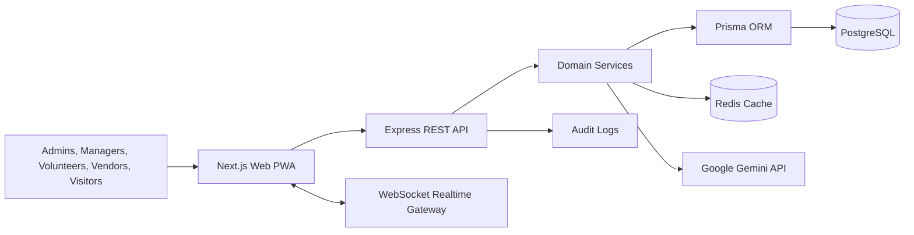

# Architecture

## Principles

- **Monorepo**: isolated apps + shared packages.
- **REST API boundaries**: route modules, DTO validation, typed responses, centralized security middleware.
- **Realtime snapshots**: operational updates broadcast over WebSocket every five seconds.
- **AI enrichment**: Gemini supports assistant responses and incident analysis; deterministic fallback keeps the system usable without a key.
- **PWA-ready frontend**: dark/light mode, responsive dashboards, keyboard navigation, and accessible controls.

## Runtime

- `apps/web`: Next.js App Router, React Query, TailwindCSS, Recharts, Framer Motion.
- `apps/server`: Express, Prisma, PostgreSQL, Redis-ready configuration, JWT, RBAC, Helmet, CORS, rate limiting.
- `packages/types`: shared operational contracts.
- `packages/ui`: shared shadcn-style primitives.
- `packages/config`: shared Tailwind and TypeScript configuration.

