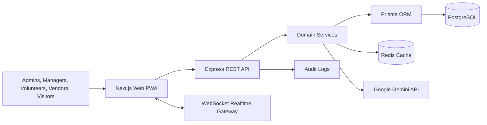

# Architecture

## Principles

- Monorepo with isolated apps and shared packages.
- REST APIs use route modules, DTO validation, service boundaries, centralized security middleware, and typed responses.
- Realtime operational snapshots are broadcast over WebSocket every five seconds.
- Gemini enriches assistant responses, incident analysis, summaries, and recommendations; deterministic fallback keeps the system usable without a key.
- PWA-ready frontend supports dark/light mode, responsive dashboards, keyboard navigation, and accessible controls.

## Runtime

- `apps/web`: Next.js App Router, React Query, TailwindCSS, Recharts, Framer Motion.
- `apps/server`: Express, Prisma, PostgreSQL, Redis-ready configuration, JWT, RBAC, Helmet, CORS, rate limiting.
- `packages/types`: shared operational contracts.
- `packages/ui`: shared shadcn-style primitives.
- `packages/config`: shared Tailwind and TypeScript configuration.
