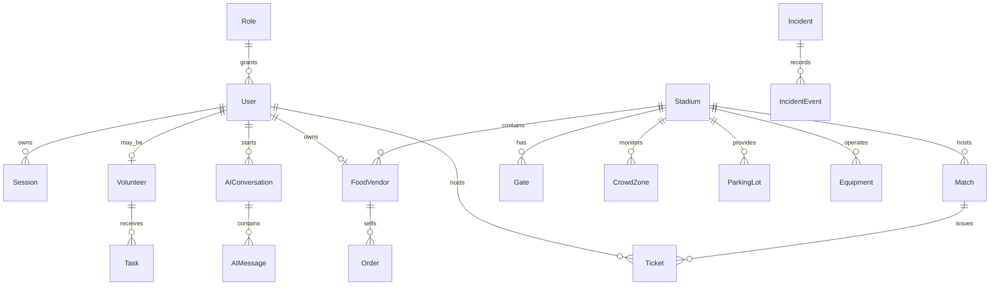

# Database ER Diagram

The Prisma schema in `apps/server/prisma/schema.prisma` defines normalized tables for users, roles, matches, stadiums, incidents, crowd telemetry, tickets, parking, food vendors, orders, maintenance, notifications, analytics/audit logs, AI conversations, and sessions.
